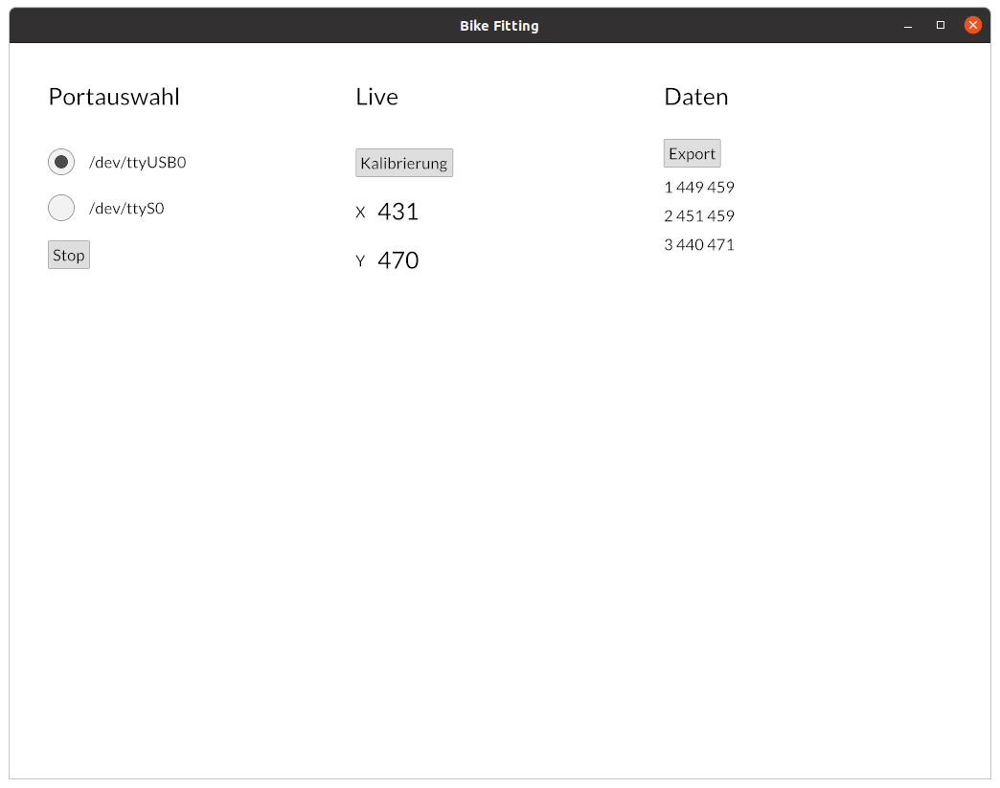

# Bikefitter

### Interface for bike fitting sensors

This application acts as a backend for a bike fitting sensor. It reads the sensors values over a serial USB connection and allows the operator to

* read the current measurement
* calibrate the sensor
* store captured measurements in an Excel file

## Running

To get started on Ubuntu, install the `libudev-dev` and `libgtk-3-dev` packages and run `cargo run`.

On Windows, open the "Developer PowerShell for VS 2019" and run `cargo run`.

## License

This program is licensed under the Gnu General Public License, Version 3. You can use and modify this program, but you must publish any changes you do to the software.

